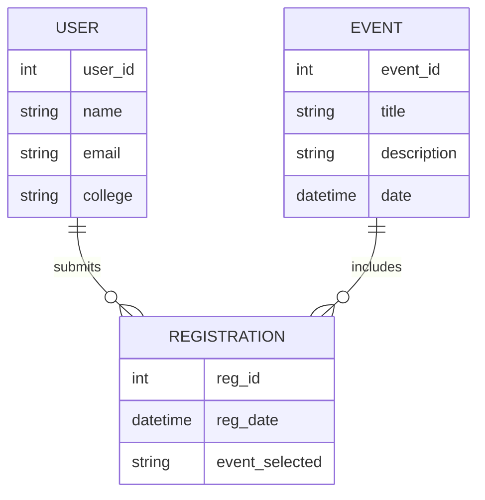
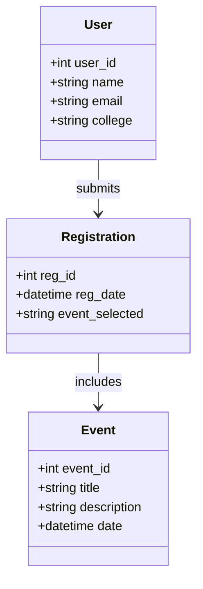

# GYAAN-2K26 Symposium Website


---

## Project Overview

**GYAAN-2K26** is a symposium website designed to showcase event details, provide registration facilities, and highlight sponsors and gallery content. It serves as the official portal for participants, organizers, and visitors to access information about the symposium.

---

## Features

- **Homepage**: Overview of the symposium and highlights.  
- **Event Information**: Details of sessions, workshops, and schedules.  
- **Registration Portal**: Online form for participants to register.  
- **Sponsors Section**: Dedicated space for partner organizations.  
- **Gallery**: Images and media from past and current events.  
- **Responsive Design**: Optimized for desktop, tablet, and mobile.  

---

## Advantages

| Feature | Advantage |
|---------|-----------|
| Responsive Design | Accessible on all devices |
| Registration Portal | Easy participant onboarding |
| Sponsors Section | Visibility for partners |
| Gallery | Showcases event highlights |
| Interactive UI | Engaging and modern look |

---

## Application Timeline

| Date | Milestone |
|------|-----------|
| Apr 2026 | Initial Design & Wireframe |
| May 2026 | Homepage & Event Info Development |
| Jun 2026 | Registration Form Integration |
| Jul 2026 | Sponsors & Gallery Section |
| Aug 2026 | Responsive Design Testing |
| Sep 2026 | Symposium Website Launch |

---

## ER Diagram (Entity Relationship)



---

## UML Class Diagram



---

## Developed By

**Dhilipan S**  
Electronics and Communication Engineering Student  

Email: [dhilipan1804@outlook.in](mailto:dhilipan1804@outlook.in)  
LinkedIn: [Dhilipan S](https://www.linkedin.com/in/dhilipan-s)  

---

## Installation

Clone the repository and open `index.html` in your browser:

```bash
git clone https://github.com/dhilipan182005/GYAAN-2K26.git
cd GYAAN-2K26
```

Open:

```bash
index.html
```

---

## Project Structure

```text
GYAAN-2K26/

├── index.html
├── style.css
├── script.js
├── assets/
├── gallery/
├── icons/
├── images/
├── sponsors/
├── node_modules/
├── package.json
├── package-lock.json
└── README.md
```
